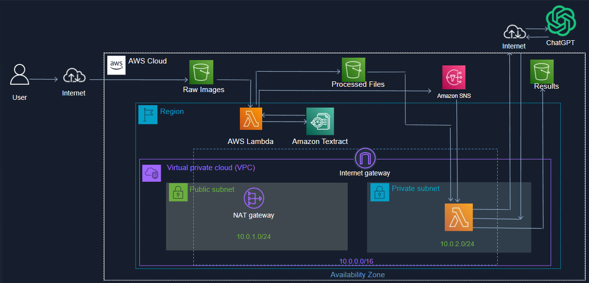

# image-to-chatgpt

- [image-to-chatgpt](#image-to-chatgpt)
  - [Summary](#summary)
  - [Topology](#topology)
  - [Region](#region)
  - [Environments Variables](#environments-variables)

## Summary
A user will upload a specific image which has specific question in it, AWS lambda will call Textract to extract text from it and calls chatGPT to get a response to that specific question

## Topology

## Region

This project has been developed in AWS East-Region to simplify communication among AWS services.

## Environments Variables

Environment variables to be added in lambda:

processed_data_bucket_name  : extracted data bucket name

openai_secret_key_env       : api key generated in chatgpt

model_chatgpt               : model name of chatgpt

output_bucket_name          : bucket output name
